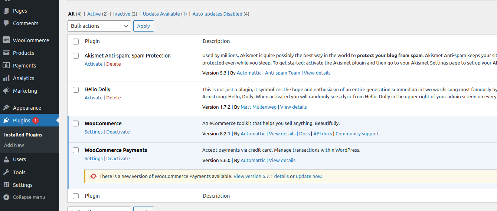
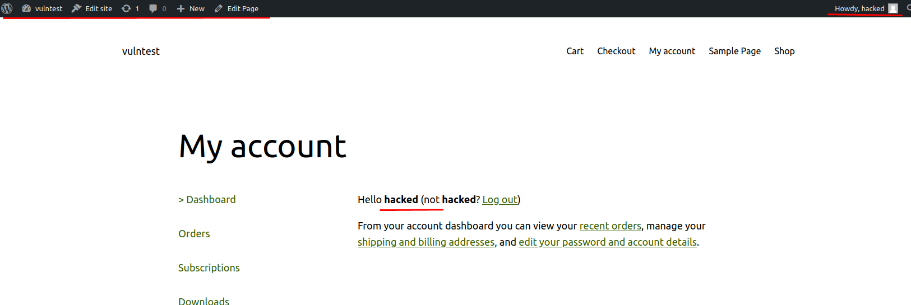

# Отчет CVE-2023-28121

процесс создания собственной пентест-лаборатории для WordPress на:

- Ubuntu 20.04
WordPress в Ubuntu 20.04

Для работы WordPress необходимы:

- Apache
- База данных (MySQL / Mariadb)
- PHP

### Apache
Запустим службу HTTP с помощью Apache, используя учетную запись с root-правами. Для этого выполним следующую команду в терминале:

```apt install apache2```

### Установка MySQL

Для работы WordPress понадобиться сервер базы данных, в качестве которого мы собираемся выбрать MariaDB.

```apt install mariadb-server mariadb-client```

### Установить php

Завершаем этап подготовки установки php php-MySQL, для чего нужно выполнить следующую команду.

```apt install php php-mysql```

Создать базу данных для WordPress

Вводим команду для создания базы данных для WP:


```
mysql -u root -p
CREATE DATABASE wordpress;
CREATE USER 'wp_user'@'localhost' IDENTIFIED BY 'password';
GRANT ALL ON wordpress.* TO 'wp_user'@'localhost' IDENTIFIED BY 'password';
FLUSH PRIVILEGES;
exit
```

### Установка и настройка WordPress

Теперь пришло время загрузить и установить WordPress на нашем локальном хосте. С помощью команды wget мы получаем архив с установщиком wordpress и извлекаем его в каталог /var/www/html.

```
cd /var/www/html
wget http://www.wordpress.org/latest.tar.gz
tar –xvf latest.tar.gz
```
Данная команда изменит владельца каталога «wordpress» и даст разрешение на загрузку файлов.

```
chown -R www-data:www-data wordpress/
chmod -R 755  wordpress/
mkdir wordpress/wp-content/uploads
chown -R  www-data:www-data wordpress/wp-content/uploads
```

Теперь чтобы начать процесс установки необходимо ввести в браузере адрес сайта, который в нашем случае расположен на локальном хосте.

```
http://localhost/wordpress/
```
* Выбираем язык 
* ```Let's go!```

Чтобы WordPress правильно установился и работал необходимо ввести данные для подключения к созданной ранее базе данных.

```
datadase name : wordpress
username : wp_user
password :password
database host : localhost
table prefix : wp_
```
Продолжаем
```submit```

Далее необходимо ввести данные нашего веб-сайта.

Продолжаем
```install wordpress```

Стоит отметить, что запрашиваемые данные логина и пароля:


- Перед установкой WP – относятся к информации о базе данных.
- После установки WP – относятся к админке WordPress.

После этого откроется страница входа в админку WordPress.

Откройте файл ```wp-config.php``` в каталоге wordpress и вставьте в него следующие строки, чтобы получить доступ к странице веб-сайта (/var/www/html/wordpress/).


Вот и все готово и наш WordPress для пентеста готов к работе.

{WOOCOM PAYMENT INSTALL}

## Установка плагина WooCommerce Payments 4.8.0 - 5.6.1

Скачиваем архив - https://wordpress.org/plugins/woocommerce-payments/advanced/

В конце страницы выбираем версию которую нас интересует (4.8.0 - 5.6.1)

распаковываем в ```/var/www/html/wordpress/wp-content/plugins/ ```


* Wordpress посоветует установить WooCommerce - устанавливаем

Активируем плагины в у нас должно получиться следующее: 




{ПОЯСНЕНИЕ УЯЗВИМОСТИ}

{ЗАПРОС}


# Программа 
- ```woo-request.py```
- ```targets.txt```

В файле содержаться адреса доменов для тестов 

```
http://192.168.117.128/worpress/
...
```

Запуск скрипта требует установленного Python 3.8 - 3.11

 ```python woo-request.py```

- (```!] target: syntax not supported or server not exist``` - ошибка при которой либо сервер из списка недоступен, либо неправильно введен домен)

при успешной эксплуатации код должен быть 201 и ответ сервера предоставляет нам информацию о новом пользователе с правами администратора:


Если просмотреть пользователей то мы увидем новый аккаунт с правами Администратора:


Заходим на новый аккаунт:


И нам доступен весь функционал Администратора 



